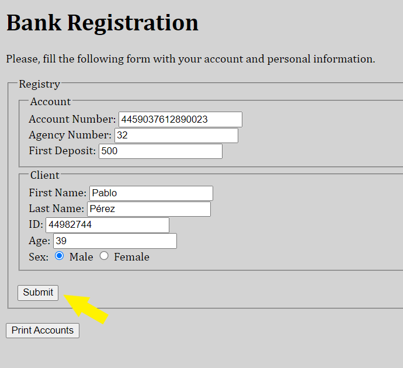
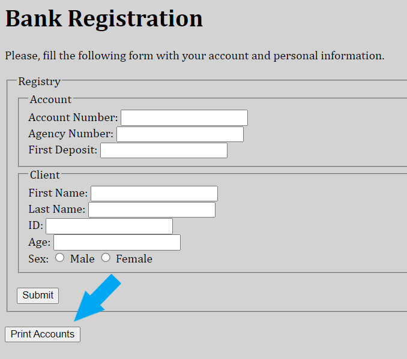
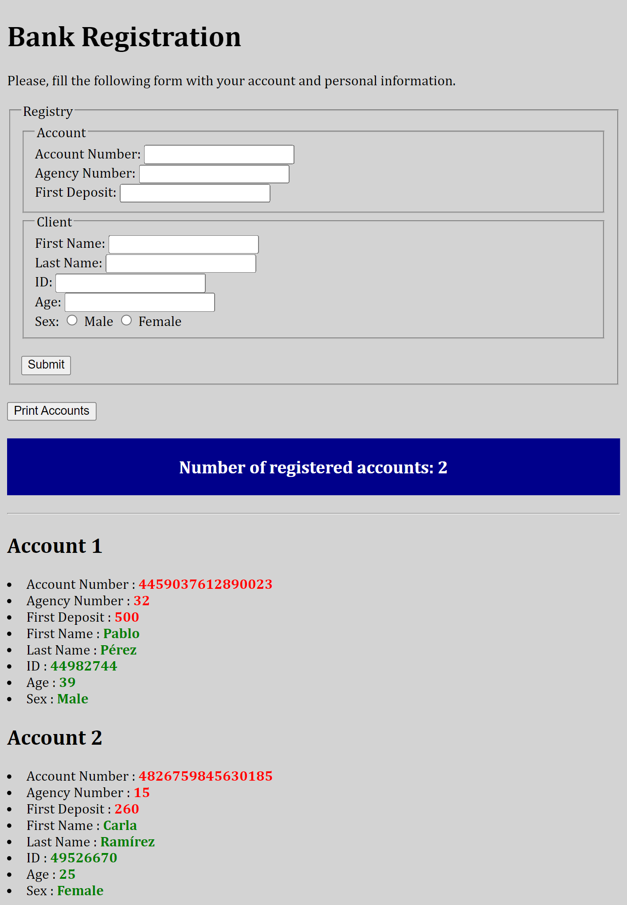

# Segunda Pre-Entrega

## Indicaciones sobre uso:

**AVISO:** Como se requiere el ingreso de varios campos de información,
se reemplaza el uso de `prompt()` con un formulario de
inputs. 
Debido a la naturaleza de la aplicación web, el
uso de `prompt()` termina siendo tedioso para el usuario.
A pesar de ser una de las consignas de la pre-entrega, la
utilización de dicha función en este caso da una precaria
experiencia de usuario a la aplicación web. Se apela al
criterio del evaluador.

- En primer lugar se llena el formulario con la data de la cuenta, luego
  se sube dicha información para que sea guardada dando click en el botón _Submit_. 
  Se pueden ingresar la información de la cantidad de cuentas que se
  requiera repitiendo el paso mencionado.

- Una vez terminado el ingreso de data se procede a dar click sobre
  el botón _Print Accounts_ para imprimir un resumen con la
  información de cada cuenta ingresada.

- Por último, se obtiene en pantalla el resumen de la data ingresada.

